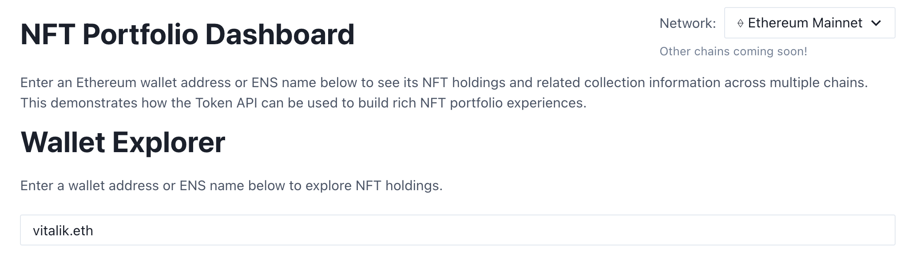

<p align="center">
  
</p>

<p align="center">
  <a href="https://nextjs.org/"></a>
  <a href="https://chakra-ui.com/"></a>
  <a href="LICENSE"></a>
</p>

# The Graph's Token API - NFT Portfolio Dashboard Demo

A modern, multi-chain NFT portfolio dashboard built with Next.js, Chakra UI, and The Graph Token API. Explore wallet holdings, top holders, collection stats, recent sales, and on-chain activity for any Ethereum address or ENS name.

---

## 🚀 Features

- Address lookup for NFT holdings
- Collection explorer: stats, holders, sales, activity
- Powered by [Token API](https://thegraph.com/docs/en/token-api/quick-start/)
- Responsive, clean UI (Chakra UI)
- Multi-chain ready (Ethereum mainnet only for now; others coming soon)
- **All UI components are copy-paste ready** for use in your own projects!

---

## 🛠️ Quick Start

1. **Clone the repo:**
   ```bash
   git clone https://github.com/marcusrein/nft-portfolio-dashboard.git
   cd nft-portfolio-dashboard
   ```
2. **Install dependencies:**
   ```bash
   npm install
   # or
   pnpm install
   ```
3. **Configure environment variables:**
  Add your JWT Key gathered from [The Graph Market](https://thegraph.market/).
   ```bash
   # Edit .env.local and set:
   NEXT_PUBLIC_TOKEN_API_JWT_KEY=your_token_api_jwt_here
   ```

4. **Run the app:**
   ```bash
   pnpm run dev
   ```
5. **Open [http://localhost:3000](http://localhost:3000)**

---

## 🗂️ Project Structure

```
src/
  ├── components/     # Reusable UI widgets (WalletCard, CollectionStatsBadge, ...)
  ├── hooks/          # Custom React hooks
  ├── lib/            # Token API helpers
  └── pages/          # Next.js pages
```

---

## 📦 Copy-and-Paste Component Kit

Each component in this repo is fully self-contained and can be seamlessly reused in your own React or Next.js project—no extra setup required beyond the basic dependencies.

### Available Components

- `NFTWalletHoldings`: Display NFT holdings for a wallet address
- `RecentSalesTable`: Show recent sales for a collection
- `TopHoldersTable`: Display top holders of a collection
- `ActivityFeed`: Show recent NFT activities (mints, transfers, burns)
- `CollectionStatsBadge`: Display collection statistics
- `NftThumb`: Render NFT images with IPFS support

### 1. Copy a component

Simply copy any component file you need from `src/components/` into your project. Each component is self-contained with all necessary API calls and utilities inline.

### 2. Install peer dependencies

Run one of the following to install the required packages:
```bash
# npm
npm install @chakra-ui/react @emotion/react @emotion/styled framer-motion react-query

# pnpm
pnpm add @chakra-ui/react @emotion/react @emotion/styled framer-motion react-query
```  

### 3. Configure environment variables

Create a `.env.local` (Next.js) or `.env` (CRA/Vite) file in your project root and add your JWT for Token API:
```bash
# Next.js (publicly exposed)
NEXT_PUBLIC_TOKEN_API_JWT_KEY=YOUR_TOKEN_API_JWT_KEY

# Create React App (prefix with REACT_APP_)
REACT_APP_TOKEN_API_JWT_KEY=YOUR_TOKEN_API_JWT_KEY

# Vite (prefix with VITE_)
VITE_TOKEN_API_JWT_KEY=YOUR_TOKEN_API_JWT_KEY
```

> **Tip:** Prefixes are required so that your build tool exposes the variables to the browser.

### 4. Wrap your App with providers

Ensure your application root is wrapped in Chakra UI and React Query providers.

```jsx
// Next.js: pages/_app.js
import { ChakraProvider } from "@chakra-ui/react";
import { QueryClient, QueryClientProvider } from "react-query";

const queryClient = new QueryClient();
export default function App({ Component, pageProps }) {
  return (
    <ChakraProvider>
      <QueryClientProvider client={queryClient}>
        <Component {...pageProps} />
      </QueryClientProvider>
    </ChakraProvider>
  );
}
```

```jsx
// Create React App / Vite: src/index.js (or main.jsx)
import React from "react";
import { createRoot } from "react-dom/client";
import App from "./App";
import { ChakraProvider } from "@chakra-ui/react";
import { QueryClient, QueryClientProvider } from "react-query";

const queryClient = new QueryClient();
createRoot(document.getElementById("root")).render(
  <ChakraProvider>
    <QueryClientProvider client={queryClient}>
      <App />
    </QueryClientProvider>
  </ChakraProvider>
);
```

### 5. Import and use your component

Now you can import any component directly:

```jsx
// e.g. in App.js or any page/component
import { CollectionStatsBadge } from "./components/CollectionStatsBadge";
import { NFTWalletHoldings } from "./components/NFTWalletHoldings";

function Demo() {
  return (
    <>
      <CollectionStatsBadge
        contract="0xbd3531da5cf5857e7cfaa92426877b022e612cf8"
        networkId="mainnet"
      />
      <NFTWalletHoldings address="vitalik.eth" networkId="mainnet" />
    </>
  );
}
export default Demo;
```

And that's it—all components are self-contained and will render and fetch data as expected with no further wiring.

---

## 📝 License

MIT